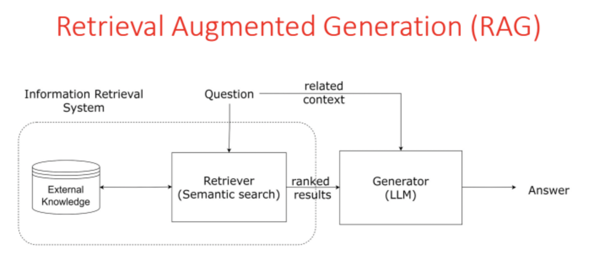
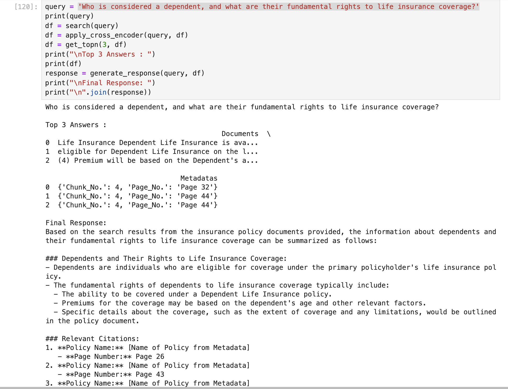
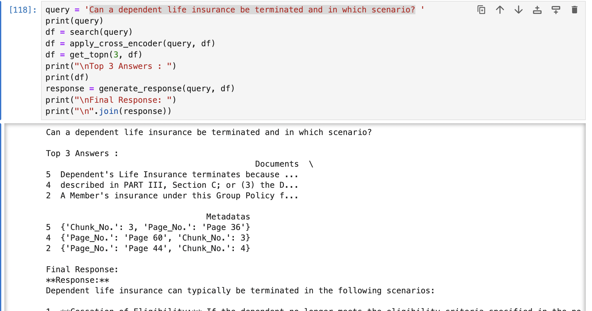
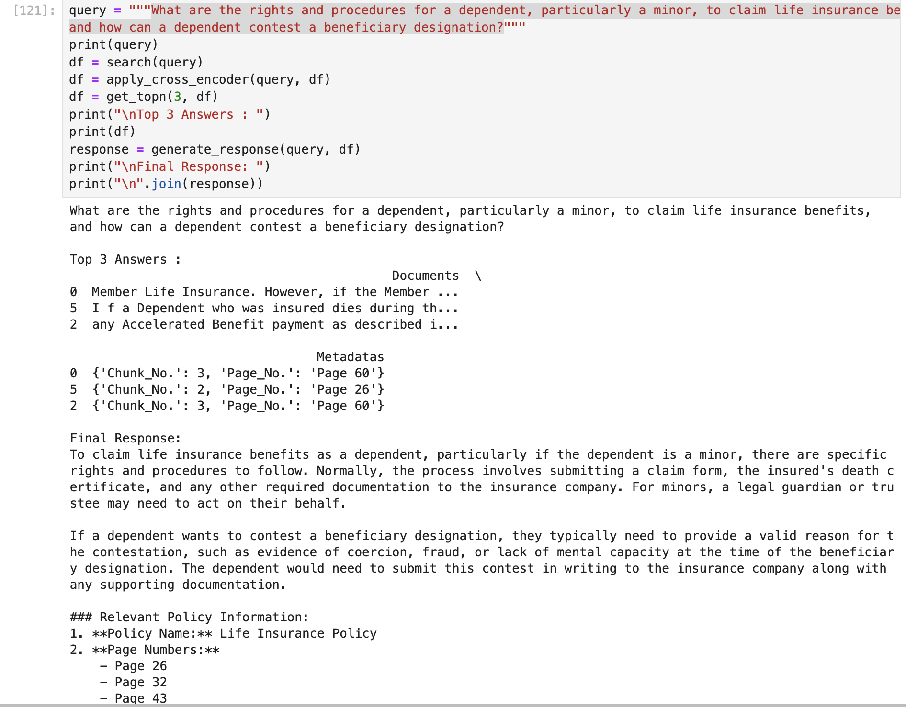

# Mr.HelpMateAISearchSystem
Mr. HelpMate AI Search System for Insurance Policy using RAG Approach

## 1. Objective
Mr.HelpMate AI, a specialized chatbot, was developed using a Retrieval-Augmented Generation (RAG) architecture to answer questions from a dense life insurance policy.

First, the policy document was processed into smaller text chunks, which were then converted into semantic embeddings and indexed in a ChromaDB vector database.

When a user submits a query, the system retrieves the most relevant chunks, re-ranks them for accuracy using a cross-encoder, and feeds them to a Large Language Model (LLM). The LLM then synthesizes a precise, context-aware answer, delivering it to the user through a simple chatbot interface.

## 2. Approach
ShopAssist AI employs a multi-stage approach to deliver tailored laptop recommendations:
1.  **Conversational Requirement Elicitation:** The chatbot initiates a natural language dialogue, leveraging Large Language Models (LLMs) to understand user needs. It dynamically asks pertinent questions to comprehensively gather specific requirements and preferences.
2.  **Structured Profile Generation & Product Matching:** As the conversation progresses, user requirements are systematically extracted and structured (e.g., into a JSON profile via function calling). This profile is then matched against the laptop dataset using rule-based logic and scoring mechanisms to identify the top 3 most suitable laptops.
3.  **Interactive Recommendation & Refinement:** The curated list of top laptops is presented to the user. The chatbot then facilitates further interaction, allowing users to ask detailed questions about the recommended products, compare options, and refine their choice, ensuring they find the ideal laptop.

**Step 1: Data Processing and Chunking (The Foundation)**
The raw life insurance policy PDF was loaded and its text content was extracted and cleaned to remove artifacts like headers, footers, and page numbers.
To prepare the document for analysis, the cleaned text was strategically divided into smaller, overlapping "chunks." This chunking process is critical, as it ensures that complete thoughts and policy clauses are kept together, providing meaningful context for the subsequent steps.

**Step 2: Embedding and Indexing (Creating the Knowledge Base)**
Each text chunk was converted into a numerical representation, or "embedding," using the all-MiniLM-L6-v2 sentence-transformer model. These embeddings capture the semantic meaning of the text.
All generated embeddings were then loaded into a ChromaDB vector database. This database acts as a searchable library, indexing the chunks based on their semantic meaning rather than just keywords.

**Step 3: Query, Retrieval, Caching and Re-ranking (Finding the Right Information)**
When a user asks a question (e.g., "What is the grace period for a missed payment?"), the query is also converted into an embedding using the same model.
This query embedding is used to search the Cache or ChromaDB database, retrieving the most similar text chunks from the policy document.
To enhance accuracy, a cross-encoder model was used to re-rank the retrieved chunks. This step precisely scores how relevant each chunk is to the specific user query, pushing the most relevant information to the top.

**Step 4: Augmented Generation (Synthesizing the Answer)**
The top-ranked, most relevant chunks from the policy document were combined with the original user query into a carefully designed prompt.
This combined prompt was then fed to a Large Language Model (LLM). The prompt instructs the LLM to act as an insurance expert and formulate a clear, concise answer based only on the provided text chunks.


## 3. System Architecture

The Mr.HelpMate AI system employs a Retrieval-Augmented Generation (RAG) architecture. The workflow begins with ingesting and chunking a life insurance PDF into a searchable format. These chunks are converted into vector embeddings and stored in a ChromaDB database. When a user sends a query, it's also embedded and used to retrieve the most relevant chunks from the database. A cross-encoder re-ranks these results for maximum relevance. Finally, the top-ranked chunks and the original query are passed to a Large Language Model (LLM), which generates a contextually accurate answer based solely on this information.



## 4. Prerequisites
- Python 3
- OpenAI API Key(you have to add openai api key in the empty txt file (OpenAI_API_Key))

### Getting Started

To get started with HelpMate AI Search System, follow these steps:

1. **Clone the repository:**
   ```
   git clone https://github.com/umeshg1981/Mr.HelpMateAISearchSystem.git
   cd AIShoppingAssistant
   ```
2. **Launch Jupyter Lab from Anaconda Navigator**
   - Open Notebook "UmeshGoyal_HelpmateAI.ipynb"
   - Open "OpenAI_API_Key.txt" and Replace with correct OpenAI API key.
     
3. **Install dependencies:**
```   
# Install the following packages incase they're not loaded already
# !pip install --upgrade pdfplumber
# !pip install --upgrade  googleapis-common-protos
# !pip install --upgrade  chromadb
# !pip install --upgrade  tiktoken
# !pip install --upgrade openai
# !pip install --upgrade sentence-transformers
# !pip install --upgrade tf-keras
# !pip install --upgrade "posthog<3.0.0" # To remove ChromaDB error for positional arguments (3 instead of 1)
```


## 5. Challenges Faced

1. Optimal Document Chunking: The core challenge is splitting the policy document into chunks that are large enough for context but small enough to be precise, without separating complete clauses.
2. Ensuring Retrieval Accuracy: A key difficulty is ensuring the system retrieves the exact document chunk that answers the user's query, which often requires a re-ranking layer to improve precision.
3. Preventing LLM Hallucination: The primary challenge is compelling the LLM to answer faithfully based only on the provided context, requiring meticulous prompt engineering to prevent it from inventing information.
4. Handling Ambiguous Queries: A significant hurdle is handling vague user queries that require the system to find and synthesize information from multiple, distinct document sections to form one coherent answer.
5. Meaningful Evaluation and Testing: Objectively measuring the chatbot’s quality is difficult because it demands the manual creation of a robust test set with "gold standard" answers to verify factual accuracy.

## 6. Lessons Learned

1. The project’s success hinges more on the precision of the data retrieval system than the power of the LLM, proving that providing the right context is the most critical factor.
2. Meticulous prompt engineering is absolutely essential to force the LLM to remain faithful to the retrieved context and prevent it from hallucinating answers based on its general training data.
3. System reliability is only achievable through a continuous, iterative cycle of testing against a manually-verified evaluation set to objectively measure the impact of each refinement.

## 7. Appendix

User Query, Top 3 results and Response example screenshot








